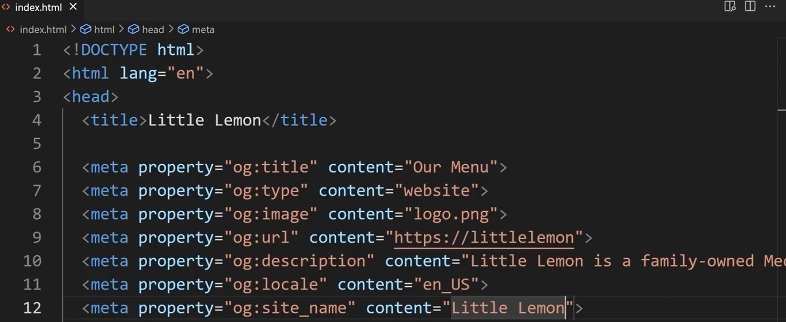

## Simple HTML Tags — Notes

### 1. Headings
- Use `` to `` for titles and subtitles.
- `` is the largest, `` is the smallest.

**Example:**
```html
Main Title
Sub Title
```

### 2. Paragraphs
- Paragraphs are defined with ` ... `.
- Line breaks in code are ignored in display.

**Example:**
```html
This is a paragraph.
```

### 3. Line Breaks
- Use `` to force a line break inside text.
- `` has no closing tag.

**Example:**
```html
Line oneLine two
```

### 4. Strong and Bold
- `` indicates important content (semantically meaningful, for accessibility).
- `` simply makes text bold (for visual attention).

**Example:**
```html
Warning: Do not feed dogs chocolate.
The primary colors are red, yellow and blue.
```

### 5. Emphasis and Italics
- `` adds emphasis and is read accordingly by screen readers.
- `` makes text italic, for off-set text like book titles or terms.

**Example:**
```html
Wake up now!
The term HTML stands for HyperText Markup Language.
```

### 6. Lists
- **Unordered lists:** ``, with items in ``.
- **Ordered lists:** ``, with items in ``.

**Examples:**
```html

  Tea
  Sugar
  Milk


  Rocky
  Rocky II
  Rocky III

```

### 7. Div Tags
- `` defines a generic container for grouping content; has no visual effect unless styled.
- Can be nested inside other tags.
- Useful for layout and styling with CSS.

**Example:**
```html

  This is a paragraph inside a div

```

**With CSS styling:**
```html

div {
  border: 1px solid black;
  padding: 2px;
}


  
    This is a paragraph inside stylized divs
  

```

### 8. Comments
- Use `` to add notes in HTML code.
- Comments are not shown in the browser.

**Summary Table of Tags:**

| Purpose    | Tag(s)                         |
|------------|-------------------------------|
| Heading    | `` ... ``             |
| Paragraph  | ``                         |
| Line Break | ``                        |
| Bold       | ``, ``             |
| Italic     | ``, ``                 |
| Unordered List | ``, ``            |
| Ordered List   | ``, ``            |
| Division   | ``                       |
| Comment    | ``                |

**Notes:**
- `` and `` are for visual styling.
- `` and `` give meaning (important for SEO and accessibility).
- Use `` for bullet lists, `` for numbered lists.
- `` helps organize and style page content.


## ` Tag (Hyperlink)`

- **Purpose:** Creates a **clickable link** to another page, section, file, or email.
- **Syntax:**
  ```html
  <a href="URL">Link Text</a>
  ```
- **Key Attributes:**
  - **`href`** (required): Where the link goes.
  - **`target="_blank"`**: Opens link in a **new tab**.
  - **`title`**: Shows a tooltip when you hover.
  - **`rel="noopener noreferrer"`**: Use with `target="_blank"` for **security**.
- **Example:**
  ```html
  <a href="https://example.com" target="_blank">Visit Example</a>
  ```

## `` Tag (Image)

- **Purpose:** **Inserts an image** into the page.
- **Syntax:**
  ```html
  <a href="home.html"></a>
  ```
- **Key Attributes:**
  - **`src`** (required): Path or URL to the image.
  - **`alt`** (required for accessibility): **Describes the image**.
  - **`width`/`height`**: Set image size in pixels.
  - **`title`**: Tooltip text on hover.
---
## **CSS Basics**

### **What is CSS?**
- **CSS** (**Cascading Style Sheets**) is a language used to **style and layout web pages**.
- Controls color, fonts, spacing, positioning, layouts, and more[2][7][8].

### **Why Use CSS?**
- **Separates style from HTML content**.
- **Saves work**: style many pages by editing one `.css` file[2][9].
- Enables responsive design for different devices[2].

## **CSS Syntax**

- Consists of **selectors**, **properties**, and **values**:

  ```css
  selector {
      property: value;
  }
  ```
  **Example:**
  ```css
  p {
      color: blue;
      font-size: 18px;
  }
  ```
- **Selectors** choose which HTML elements to style[6].
- **Properties** are what you want to change (e.g., `color`).
- **Values** specify the new style (e.g., `blue`).

## **How to Add CSS**

1. **Inline**: Inside HTML elements (not recommended)
   ```html
   Text
   ```
2. **Internal**: Inside `` tags in ``
   ```html
    p {
      color: red;
      }
   
   ```
3. **External**: In a separate `.css` file (recommended)
   ```html
   <link rel="stylesheet" href="style.css">
   ```

## **Selectors**
- **Element Selector:** `p` (all `` tags)
- **Class Selector:** `.classname` (elements with class)
- **ID Selector:** `#idname` (element with id)
- **Attribute Selector:** `[attribute="value"]`
- **Pseudo-classes/elements:** `:hover`, `::after`, etc.[1][6]

## **Common Properties**

- **Colors/Background:** `color`, `background-color`
- **Text:** `font-size`, `font-family`, `font-weight`, `text-align`
- **Box Model:** `width`, `height`, `margin`, `padding`, `border`
- **Layout:** `display`, `position`, `top/right/bottom/left`, `float`, `flex`, `grid`
- **Others:** `opacity`, `z-index`, `overflow`, `max-width`, `min-height`

## **Box Model**
- Each element is a **box** with:  
  **Content → Padding → Border → Margin**.

## **Responsive Design**
- Use **media queries** for different screen sizes:
  ```css
  @media (max-width: 600px) {
    body { background: yellow; }
  }
  ```

## **Advanced Topics**
- **Flexbox / Grid:** Powerful layout systems for modern designs.
- **Animations & Transitions:** Add motion and interactive effects.
- **Selectors Specificity & Cascade:** Controls which style “wins”.

## **Tips**
- Use an **external stylesheet** to manage large sites.
- Always use **meaningful selectors** for maintainability.
- Validate your CSS for errors using tools (like the W3C Validator)[4].

**Summary:**  
CSS is **essential for styling websites**, allowing you to control how web pages look and adapt to different devices and needs. Mastering selectors, properties, and the box model is key to effective CSS.

Here are **the most important and commonly used CSS properties** every developer should know, summarized for quick documentation and easy understanding:

## **Essential CSS Properties**

- **color**: Sets the text color.
  ```css
  color: red;
  ```

- **background-color**: Sets the background color of an element.
  ```css
  background-color: #f0f0f0;
  ```

- **font-family**: Specifies the typeface.
  ```css
  font-family: Arial, sans-serif;
  ```

- **font-size**: Sets the size of the text.
  ```css
  font-size: 16px;
  ```

- **font-weight**: Controls the boldness.
  ```css
  font-weight: bold;
  ```

- **line-height**: Sets the space between lines of text.
  ```css
  line-height: 1.5;
  ```

- **width / height**: Sets the size of an element.
  ```css
  width: 300px;
  height: 200px;
  ```

- **margin**: Controls spacing **outside** the border.
  ```css
  margin: 20px;
  ```

- **padding**: Controls spacing **inside** the border, around content.
  ```css
  padding: 10px;
  ```

- **border**: Sets the border's width, style, and color.
  ```css
  border: 1px solid #333;
  ```

- **display**: Determines the display behavior (`block`, `inline`, `flex`, `grid`, etc.).
  ```css
  display: flex;
  ```

- **position**: Positions element (`static`, `relative`, `absolute`, `fixed`, `sticky`).
  ```css
  position: absolute;
  top: 50px;
  left: 20px;
  ```

- **flex / grid**: Modern layout systems.
  ```css
  display: flex;
  display: grid;
  ```

- **justify-content / align-items**: Align and distribute items inside flex or grid containers.
  ```css
  justify-content: space-between;
  align-items: center;
  ```

- **z-index**: Controls stack order of positioned elements (used with `position`).
  ```css
  z-index: 10;
  ```

- **overflow**: Controls what happens when content overflows its box.
  ```css
  overflow: auto; /* or hidden, scroll, visible */
  ```

- **object-fit**: Defines how an image or video should fit in its container.
  ```css
  object-fit: cover;
  ```

- **box-shadow**: Adds shadow to elements.
  ```css
  box-shadow: 0 4px 8px rgba(0,0,0,0.2);
  ```

- **opacity**: Sets the transparency.
  ```css
  opacity: 0.8;
  ```

- **transition**: Smoothly animates property changes.
  ```css
  transition: background 0.3s;
  ```

- **:hover / :focus / :active**: Pseudo-classes for interaction styles.
  ```css
  a:hover { color: blue; }
  ```

- **!important**: Overrides all other declarations for that property (use sparingly).
  ```css
  color: green !important;
  ```

These properties form the foundation for most web layouts and designs. Mastery of **margin, padding, display, color, font, position, and layout (flex, grid)** is crucial for CSS development.

## **CSS Box Model**

The **CSS box model** is a fundamental concept used to understand how elements are structured and laid out on a web page. Every HTML element is considered as a rectangular box, which consists of four parts:

### **Box Model Structure**

1. **Content**  
   - The actual text, image, or other media inside the element.

2. **Padding**  
   - Transparent space around the content, *inside* the border.  
   - Increases the space between content and border.

3. **Border**  
   - A line surrounding the padding and content.
   - Thickness, style, and color can be adjusted (e.g., `1px solid #333`).

4. **Margin**  
   - Transparent space *outside* the border.
   - Creates separation between elements.

### **Box Model Diagram**

```
+-----------------------------+
|         Margin              |
|  +-----------------------+  |
|  |      Border           |  |
|  |  +-----------------+  |  |
|  |  |    Padding      |  |  |
|  |  | +-----------+   |  |  |
|  |  | | Content   |   |  |  |
|  |  | +-----------+   |  |  |
|  |  +-----------------+  |  |
|  +-----------------------+  |
+-----------------------------+
```

### **Box Model Example in CSS**

```css
div {
  width: 300px;           /* Content width */
  height: 100px;          /* Content height */
  padding: 20px;          /* Space inside the border */
  border: 2px solid blue; /* Border thickness and color */
  margin: 30px;           /* Space outside the border */
}
```

### **Total Element Size Calculation**

By default (using `box-sizing: content-box`), the total size **includes** content, padding, and border (not margin):

- **Total Width:**  
  $$ \text{width} + \text{left padding} + \text{right padding} + \text{left border} + \text{right border} $$
- **Total Height:**  
  $$ \text{height} + \text{top padding} + \text{bottom padding} + \text{top border} + \text{bottom border} $$

To make `width` and `height` include padding and border (recommended for easier layout), use:

```css
box-sizing: border-box;
```

### **Summary Table**

| Layer     | Purpose                         | CSS Properties             |
|-----------|---------------------------------|----------------------------|
| Content   | Displays element’s main content | `width`, `height`          |
| Padding   | Space *inside* border           | `padding`, `padding-top`…  |
| Border    | Outlines the element            | `border`, `border-width`…  |
| Margin    | Space *outside* border          | `margin`, `margin-top`…    |

**Key Points**
- **Margin:** Separates from other elements.
- **Border:** Visual outline.
- **Padding:** Space between border and content.
- **Content:** The innermost part.

---

## **HTML Block vs. Inline Elements**

### **Block Elements**
- **Start on a new line** and take up the **full width** available, stretching from left to right of their parent container[1][2][4][6].
- **Browsers automatically add space (margins) above and below** block elements[1][2].
- Can contain **other block elements and inline elements**[7].
- **Common examples**:
  - ``
  - ``
  - ``–``
  - ``, ``, ``
  - ``, ``
  - ``, ``, ``, ``, ``.
- **Usage:** Structure major sections of a web page (headings, paragraphs, sections, lists).

### **Inline Elements**
- **Do not start on a new line**; appear **in-line with surrounding content**[1][2][4][6].
- Only take up **as much width as necessary** for their content—do **not** stretch the whole line[2][4].
- **Do not have top or bottom margins** by default[2][4][6].
- **Cannot contain block elements.**
- **Common examples**:
  - ``
  - ``
  - ``, ``, ``, ``
  - ``
  - ``, ``, ``.
- **Usage:** Mark up a **piece of text** or element within a block (emphasize, style, or create links).

### **Comparison Table**

|                | **Block Elements**                         | **Inline Elements**                 |
|----------------|--------------------------------------------|-------------------------------------|
| **Line**       | Start on a new line                        | Do not start on a new line          |
| **Width**      | Take up full available width                | Only as wide as their content       |
| **Margin**     | May have top and bottom margins             | No top or bottom margin             |
| **Containment**| Can contain block & inline elements         | Only contain other inline elements  |
| **Examples**   | ``, ``, ``, ``, ``  | ``, ``, ``, ``     |

**Summary:**  
- Use **block elements** for major sections and layout.
- Use **inline elements** for emphasizing or marking up sections within lines of text.  
- Choosing the right type helps structure and control your webpage’s layout and appearance.

# Semantic HTML cheat sheet 

There are hundreds of semantic tags available
to help describe the meaning of your HTML documents. Below is a cheat
sheet with some of the most common ones you'll use in this course and in
your development career.

Sectioning tags Use the following tags to organize your HTML document
into structured sections.

```{=html}
<header>
```
The header of a content section or the web page. The web page header
often contains the website branding or logo.

```{=html}
<nav>
```
The navigation links of a section or the web page.

```{=html}
<footer>
```
The footer of a content section or the web page. On a web page, it often
contains secondary links, the copyright notice, privacy policy and
cookie policy links.

```{=html}
<main>
```
Specifies the main content of a section or the web page.

```{=html}
<aside>
```
A secondary set of content that is not required to understand the main
content.

```{=html}
<article>
```
An independent, self-contained block of content such as a blog post or
product.

```{=html}
<section>
```
A standalone section of the document that is often used within the body
and article elements.

```{=html}
<details>
```
A collapsed section of content that can be expanded if the user wishes
to view it.

```{=html}
<summary>
```
Specifies the summary or caption of a `<details>` element.

```{=html}
<h1><h2><h3><h4><h5><h6>
```
Headings on the web page.
```{=html}
<h1>
```
indicates the most important heading whereas
```{=html}
<h6>
```
indicates the least important. 

# Content tags
```{=html}
<blockquote>
```
Used to describe a quotation.

```{=html}
<dd>
```
Used to define a description for the preceding `<dt>` element.

```{=html}
<dl>
```
Used to define a description list.

```{=html}
<dt>
```
Used to describe terms inside
```{=html}
<dl>
```
elements.

```{=html}
<figcaption>
```
Defines a caption for a photo image.

```{=html}
<figure>
```
Applies markup to a photo image.

```{=html}
<hr>
```
Adds a horizontal line to the parent element.

```{=html}
<li>
```
Used to define an item within a list.

```{=html}
<menu>
```
A semantic alternative to `<ul>` tag.

```{=html}
<ol>
```
Defines an ordered list.

```{=html}
<p>
```
Defines a paragraph.

```{=html}
<pre>
```
Used to represent preformatted text. Typically rendered in the web
browser using a monospace font.

```{=html}
<ul>
```
Unordered list

# Inline tags

```{=html}
<a>
```
 An anchor link to another HTML document.

```{=html}
<abbr>
```
Specifies that the containing text is an abbreviation or
acronym.

```{=html}
<b>
```
Bolds the containing text. When used to indicate importance
use `<strong>`{=html} instead.

```{=html}
<br>
```
 A line break. Moves the subsequent text to a new line.

```{=html}
<cite>
```
Defines the title of creative work (for example a book,
poem, song, movie, painting or sculpture). The text in the
`<cite>`{=html} element is usually rendered in italics.

```{=html}
<code>
```
 Indicates that the containing text is a block of
computer code.

```html
<data>
```
Indicates machine-readable data.

```{=html}
<em>
```
 Emphasizes the containing text.

```html 
<i>
```
The containing text is displayed in italics. Used to
indicate idiomatic text or technical terms.

```html 
<mark>
```
The containing text should be marked or highlighted.

```html
<q>
```
The containing text is a short quotation.

```html
<s>
```
Displays the containing text with a strikethrough or line
through it.

```html
<samp>
```
The containing text represents a sample.

```html
<small>
```
Used to represent small text, such as copyright and
legal text.

```{=html}
<span>
```
A generic element for grouping content for CSS styling.

```{=html}
<strong>
``` 
Displays the containing text in bold. Used to indicate
importance.

```{=html}
<sub>
``` 
The containing text is subscript text, displayed with a
lowered baseline.

```html
<sup>
```
The containing text is superscript text, displayed with a
raised baseline.

```html
<time>
```
A semantic tag used to display both dates and times.

```html
<u>
```
Displays the containing text with a solid underline.

```html
<var>
```
The containing text is a variable in a mathematical
expression.

# Embedded content and media tags

```html
<audio>
```
Used to embed audio in
web pages.

```{=html}
<canvas>
```
Used to render 2D and 3D graphics on web pages.

```{=html}
<embed>
```
Used as a containing element for external content provided by an
external application such as a media player or plug-in application.

```{=html}
<iframe>
```
Used to embed a nested web page.

```html

```
Embeds an image on a web page.

```{=html}
<object>
```
Similar to `<embed>` but the content is provided by a web browser
plug-in.

```html 
<picture>
```
An element that contains one `` element
and one or more `<source>` elements to offer alternative images
for different displays/devices.

```{=html}
<video>
```
Embeds a video on a web page.

```{=html}
<source>
```
Specifies media resources for `<picture>`, `<audio>` and `<video>` elements.

```{=html}
<svg>
```
Used to define Scalable Vector Graphics within a web page.

# Table tags
```{=html}
<table>
```
Defines a table element to display table data within a web page.

```{=html}
<thead>
```
Represents the header content of a table. Typically contains one `<tr>` element.

```{=html}
<tbody>
```
Represents the main content of a table. Contains one or more `<tr>` elements.

```{=html}
<tfoot>
```
Represents the footer content of a table. Typically contains one `<tr>` element.

```{=html}
<tr>
```
Represents a row in a table. Contains one or more `<td>` elements when used within `<tbody>` or `<tfoot>`. When used within `<thead>` ,contains one or more `<th>` elements.

```{=html}
<td>
```
Represents a cell in a table. Contains the text content of the cell.

```{=html}
<th>
```
Defines a header cell of a table. Contains the text content of the
header.

```{=html}
<caption>
```
Defines the caption of a table element.

```{=html}
<colgroup>
```
Defines a semantic group of one or more columns in a table for
formatting.

```{=html}
<col>
```
Defines a semantic column in a table

# Metadata cheat sheet

## HTML `<meta>` tags

Earlier in the course, you learned about meta tags and how you can
leverage them to convey information to search engines to better
categorize your pages. We recommend that you keep this cheat sheet handy
when building your web applications. The structure of a meta tag is as
follows.

### Name

The name of the property can be anything you like, although browsers
usually expect a value they understand and can take an action upon. An
example would be:

``` html
<meta name="author" content="name">
```

to state the author of the page.

### Content

The content field specifies the property's value. For example, you can
use:

``` html
<meta name="language" content="english">
```

to specify the language of the webpage to search engines.

### Charset

The charset is a special field that lets you specify the character
encoding used for the page so that the browser can display it properly.
The most frequently used is UTF-8, and you would add it to your HTML
header as follows:

``` html
<meta charset="UTF-8">
```

### HTTP-equiv

This field stands for HTTP equivalent, and it's used to simulate HTTP
response headers. This is rare to see, and it's recommended to use HTTP
headers over HTML http-equiv meta tags. For example, the next tag would
instruct the browser to refresh the page every 30 minutes:

``` html
<meta http-equiv="refresh" content="30">
```

------------------------------------------------------------------------

## Basic meta tags (meta tags For SEO)

``` html
<meta name="description"/>
```

Provides a brief description of the web page.

``` html
<meta name="title"/>
```

Specifies the title of the web page.

``` html
<meta name="author" content="name">
```

Specifies the author of the web page.

``` html
<meta name="language" content="english">
```

Specifies the language of the web page.

``` html
<meta name="robots" content="index,follow" />
```

Tells search engines how to crawl or index a certain page.

``` html
<meta name="google"/>
```

Tells Google not to show the sitelinks search box for your page when
showing search results.

``` html
<meta name="googlebot" content="notranslate" />
```

Tells Google you don't want to provide an automatic translation for your
page if the user uses a different language.

``` html
<meta name="revised" content="Sunday, July 18th, 2010, 5:15 pm" />
```

Specifies the last modified date and time on which you have made certain
changes.

``` html
<meta name="rating" content="safe for kids">
```

Specifies the expected audience for your page.

``` html
<meta name="copyright" content="Copyright 2022">
```

Specifies a Copyright.

------------------------------------------------------------------------

## `<meta http-equiv="..."/>` tags

``` html
<meta http-equiv="content-type" content="text/html">
```

Specifies the format of the document returned by the server.

``` html
<meta http-equiv="default-style"/>
```

Specifies the format of the styling document.

``` html
<meta http-equiv="refresh"/>
```

Specifies the duration of the page before it's considered stale.

``` html
<meta http-equiv="Content-language"/>
```

Specifies the language of the page.

``` html
<meta http-equiv="Cache-Control" content="no-cache">
```

Instructs the browser how to cache your page.

------------------------------------------------------------------------

## Responsive design/mobile meta tags

``` html
<meta name="format-detection" content="telephone=yes"/>
```

Indicates that telephone numbers should appear as hypertext links that
can be clicked to make a phone call.

``` html
<meta name="HandheldFriendly" content="true"/>
```

Specifies that the page can be properly visualized on mobile devices.

``` html
<meta name="viewport" content="width=device-width, initial-scale=1.0"/>
```

Specifies the area of the window in which web content can be seen.

Example:



---

# Open Graph Protocol (**OGP**)
Open Graph Protocol (**OGP**) is a standard introduced by **Facebook** that allows web pages to become "rich objects" when shared on social media platforms. In simpler words, it tells platforms like Facebook, LinkedIn, Twitter (with some differences), WhatsApp, and others how to display a link preview when someone shares your page.

---

### 🔹 Why OGP is Important?

* Controls **how your link looks** when shared (title, image, description).
* Improves **click-through rate (CTR)** by showing an attractive preview.
* Ensures **consistency** across platforms.
* Helps with **SEO and branding** indirectly (though not a ranking factor).

---

### 🔹 How OGP Works

OGP uses `<meta>` tags inside the `<head>` of an HTML page.
When someone shares your link, the platform’s crawler looks for these tags and builds the preview card.

---

### 🔹 Basic OGP Tags

Here’s a minimal example:

```html
<head>
  <title>My Website</title>
  <meta property="og:title" content="My Awesome Page" />
  <meta property="og:description" content="This is a description of my awesome page." />
  <meta property="og:image" content="https://example.com/image.jpg" />
  <meta property="og:url" content="https://example.com/page" />
  <meta property="og:type" content="website" />
</head>
```

---

### 🔹 Common OGP Properties

| Property            | Description                                                            |
| ------------------- | ---------------------------------------------------------------------- |
| **og\:title**       | Title of the page (max \~60 chars recommended).                        |
| **og\:description** | Short description (\~110 chars for Facebook, \~200 for LinkedIn).      |
| **og\:image**       | Image URL (ideal: 1200x630 px, JPG/PNG, <5MB).                         |
| **og\:url**         | Canonical URL of the page.                                             |
| **og\:type**        | Type of object (e.g., `website`, `article`, `video`, `music`, `book`). |
| **og\:site\_name**  | Website name (brand identity).                                         |
| **og\:locale**      | Language/locale (e.g., `en_US`).                                       |

---

### 🔹 Extended Tags

* **For articles:**

  ```html
  <meta property="article:author" content="https://example.com/author/john" />
  <meta property="article:published_time" content="2025-08-18T12:00:00Z" />
  <meta property="article:tag" content="Technology" />
  ```

* **For videos:**

  ```html
  <meta property="og:video" content="https://example.com/video.mp4" />
  <meta property="og:video:type" content="video/mp4" />
  ```

---


# 📘 HTML Input Types Cheat Sheet

## 🔹 1. Button Inputs

* **Button (`button`)**
  Creates a clickable button.

  ```html
  <input type="button" value="Click me" onclick="alert('Hello!')" />
  ```
* **Alternative with `<button>` (more flexible)**

  ```html
  <button onclick="alert('Are you sure?')">
    
  </button>
  ```

---

## 🔹 2. Choice Inputs

* **Checkbox** → Select one or multiple options.

  ```html
  <input type="checkbox" id="dog" name="dog" value="Dog">
  <label for="dog">I like dogs</label>
  ```

* **Radio** → Select only one option in a group (same `name`).

  ```html
  <input type="radio" id="light" name="theme" value="Light">
  <label for="light">Light</label>
  ```

---

## 🔹 3. Form Submission

* **Submit** → Submits the form data.

  ```html
  <form action="myserver.com" method="POST">
    <input type="submit" value="Submit">
  </form>
  ```
* **Reset** → Resets all fields to default.

  ```html
  <input type="reset">
  ```
* **Image Button** → Submit button with an image.

  ```html
  <input type="image" src="submit.png" alt="Submit" width="48" height="48">
  ```

---

## 🔹 4. Textual Inputs

* **Text** → Single-line input.

  ```html
  <label for="fname">First name:</label>
  <input type="text" id="fname" name="fname">
  ```

* **Password** → Obscured text input.

  ```html
  <input type="password" id="pwd" name="pwd">
  ```

* **Search** → Text input optimized for search.

  ```html
  <input type="search" id="gsearch" name="gsearch">
  ```

* **Email** → Input with email validation.

  ```html
  <input type="email" id="email" name="email">
  ```

* **Tel** → Input for phone numbers (with optional pattern).

  ```html
  <input type="tel" id="phone" name="phone" pattern="[+]{1}[0-9]{11,14}">
  ```

* **URL** → Input with URL validation.

  ```html
  <input type="url" id="homepage" name="homepage">
  ```

---

## 🔹 5. Numeric & Range

* **Number** → Numeric input with restrictions.

  ```html
  <input type="number" id="quantity" name="quantity" min="1" max="5">
  ```

* **Range (Slider)** → Select value within a range.

  ```html
  <input type="range" id="volume" name="volume" min="0" max="10">
  ```

---

## 🔹 6. Date & Time

* **Date** → Calendar date picker.

  ```html
  <input type="date" id="dob" name="dob">
  ```

* **Time** → Select hours & minutes.

  ```html
  <input type="time" id="appt" name="appt">
  ```

* **Datetime-local** → Date & time (without timezone).

  ```html
  <input type="datetime-local" id="birthdaytime" name="birthdaytime">
  ```

* **Month** → Select month & year.

  ```html
  <input type="month" id="bdaymonth" name="bdaymonth" min="1930-01">
  ```

* **Week** → Select week of a year.

  ```html
  <input type="week" id="week" name="week">
  ```

---

## 🔹 7. File & Hidden

* **File Upload** → Choose a file to upload.

  ```html
  <input type="file" id="myfile" name="myfile" multiple>
  ```

* **Hidden** → Hidden value (not visible but submitted).

  ```html
  <input type="hidden" name="custId" value="3487">
  ```

---

# Cheat Sheet: Interactive Form Elements

When filling in HTML forms, users may enter incorrect or incomplete data. To handle this, HTML provides **form validation attributes** that help enforce rules automatically.

### ✅ Common Validation Attributes

1. **required**

   * Marks the input as mandatory (cannot be left empty).

   ```html
   <input type="text" id="firstName" name="firstName" required>
   ```

2. **maxlength**

   * Sets the maximum number of characters allowed in the input.

   ```html
   <input type="text" id="description" name="description" maxlength="50">
   ```

3. **minlength**

   * Sets the minimum number of characters required in the input.

   ```html
   <input type="password" id="password" name="password" minlength="8">
   ```

4. **min / max**

   * Defines the allowed minimum and maximum values for inputs like number, range, or date.

   ```html
   <input type="number" id="quantity" name="quantity" min="1" max="10">
   <input type="range" id="volume" name="volume" min="1" max="100">
   ```

5. **multiple**

   * Allows users to enter/select more than one value (only for `email` and `file` input types).

   ```html
   <input type="file" id="gallery" name="gallery" multiple>
   ```

6. **pattern**

   * Enforces a specific format using Regular Expressions (works with text, tel, email, password, URL, etc.).
   * Example: Restrict phone numbers to UK format.

   ```html
   <input type="tel" id="phone" name="phone" pattern="^(?:0|\+?44)(?:\d\s?){9,10}$">
   ```

---


# 📘 Notes: HTML Form Elements

### **1. `<form>`**

* Container for form elements.
* Attributes:

  * **action** → URL where form data is sent.
  * **method** → `GET` or `POST`.

---

### **2. `<input>`**

* Creates interactive form controls.
* Key attribute: **type** → defines behavior & look.
* Common values:

  * `text` → single-line text field
  * `password` → hides input (●●●)
  * `email`, `number`, `url`, `date`
  * `checkbox`, `radio`, `submit`, `button`

**Example:**

```html
<input type="text" name="username">
<input type="password" name="pwd">
<input type="submit" value="Login">
```

---

### **3. `<label>`**

* Defines text label for input fields.
* Attribute: **for** → should match input’s **id**.
* Improves accessibility & UX.

---

### **4. `<select>`**

* Creates a drop-down list.
* Attributes:

  * **name** → control name
  * **form** → associates with a form
  * **multiple** → allows multi-selection
  * **required** → must select before submit
  * **size** → visible items count

Contains `<option>` elements.

---

### **5. `<option>`**

* Defines an item inside `<select>`.
* Attributes:

  * **value** → value sent on form submission
  * **selected** → makes option pre-selected

**Example:**

```html
<select name="course">
  <option value="html" selected>HTML</option>
  <option value="css">CSS</option>
</select>
```

---

### **6. `<optgroup>`**

* Groups related `<option>`s inside `<select>`.
* Attribute: **label** → gives group name.

---

### **7. `<textarea>`**

* Multi-line input field for longer text.
* Attributes:

  * **rows** → visible lines
  * **cols** → width (characters)
  * **maxlength** / **minlength**
  * **readonly** → makes it uneditable

**Example:**

```html
<textarea name="feedback" rows="5" cols="30" maxlength="200"></textarea>
```

---

### **8. `<button>`**

* Clickable button.
* Types:

  * `button` → generic
  * `submit` → submits form
  * `reset` → resets form fields
* **onclick** → defines behavior via JS.

---

### **9. `<fieldset>`**

* Groups related form inputs.

### **10. `<legend>`**

* Provides a caption/title for `<fieldset>`.

**Example:**

```html
<fieldset>
  <legend>Personal Info</legend>
  <input type="text" name="fname">
</fieldset>
```

---

### **11. `<datalist>`**

* Provides predefined options **with flexibility** (user can type freely).
* Used with `<input list="...">`.

**Example:**

```html
<input list="flowers" name="flower">
<datalist id="flowers">
  <option value="Rose">
  <option value="Lily">
</datalist>
```

---

### **12. `<output>`**

* Displays results of a calculation or user action.
* Typically updated with JavaScript.

---

✅ **Quick Difference:**

* **`<select>`** → user must pick from given options.
* **`<datalist>`** → user can pick OR type freely.

---

# 📘 Notes: Multimedia Tags in HTML

## 🎥 **`<video>` Tag**

* Used to embed video content in a web page.
* Needs the `controls` attribute to allow play/pause.

### **Common Attributes**

* `src` → Path/URL of the video file.
* `controls` → Adds playback controls (play, pause, volume, etc.).
* `autoplay` → Video starts playing automatically when page loads.
* `loop` → Video restarts automatically after finishing.
* `muted` → Starts video in muted mode.
* `poster` → Image shown before the video plays.
* `width`, `height` → Dimensions of the video.
* `<source>` → Defines multiple file sources (browser chooses supported one).
* `preload` → Hints how video should be loaded:

  * `auto` → Load video fully.
  * `metadata` → Only load metadata.
  * `none` → Do not preload.

### **Example**

```html
<video width="400" controls poster="thumbnail.jpg">
  <source src="movie.mp4" type="video/mp4">
  <source src="movie.ogg" type="video/ogg">
  Your browser does not support the video tag.
</video>
```

---

## 🎵 **`<audio>` Tag**

* Used to embed audio (music, sound, voice) in a web page.

### **Common Attributes**

* `src` → Path/URL of audio file.
* `controls` → Adds playback controls.
* `autoplay` → Plays audio automatically.
* `loop` → Repeats audio continuously.
* `muted` → Starts audio muted.
* `<source>` → Provides multiple audio sources.
* `preload` → `auto`, `metadata`, or `none` (same as video).

### **Example**

```html
<audio controls>
  <source src="song.mp3" type="audio/mpeg">
  <source src="song.ogg" type="audio/ogg">
  Your browser does not support the audio element.
</audio>
```

---

## 🖼️ **`` Tag**

* Embeds an image in a web page.
* It is a **self-closing tag** (no end tag).

### **Common Attributes**

* `src` → Path/URL of image (required).
* `alt` → Alternative text (shown if image fails to load, improves accessibility & SEO).
* `width`, `height` → Dimensions of image (in px or %).
* `loading` → `lazy` (load when visible), `eager` (load immediately).
* `crossorigin` → For handling cross-origin requests (`anonymous`, `use-credentials`).
* `referrerpolicy` → Controls referrer info sent when fetching image.
* `usemap` → Defines image as part of an image-map.

### **Example**

```html

```

---

✅ **Key Differences**

* `` → static images.
* `<audio>` → sound/music playback.
* `<video>` → video playback.
* Both `<audio>` and `<video>` support `<source>` for multiple formats.

---


# 📘 Notes: `allow` Attribute in `<iframe>`

The **`allow`** attribute defines **permissions / features** that the embedded iframe content can access.

It works like a **permission policy** for the iframe.
Multiple permissions are separated by a **semicolon (`;`)**.

---

## 🔑 **Common Values for `allow`**

| Value                | Purpose                                 |
| -------------------- | --------------------------------------- |
| `fullscreen`         | Allows iframe content to go fullscreen. |
| `geolocation`        | Allows access to user’s location.       |
| `camera`             | Allows access to user’s camera.         |
| `microphone`         | Allows access to user’s microphone.     |
| `autoplay`           | Allows media (video/audio) to autoplay. |
| `payment`            | Allows Payment Request API.             |
| `clipboard-write`    | Allows copying to clipboard.            |
| `accelerometer`      | Allows motion sensor data.              |
| `gyroscope`          | Allows gyroscope sensor data.           |
| `magnetometer`       | Allows magnetometer sensor data.        |
| `encrypted-media`    | Allows playback of DRM-protected media. |
| `picture-in-picture` | Allows video Picture-in-Picture mode.   |

---

## ✅ **Examples**

### 1. Allow fullscreen only

```html
<iframe src="video.html" allow="fullscreen"></iframe>
```

---

### 2. Allow multiple features (camera + microphone)

```html
<iframe src="meet.html" allow="camera; microphone"></iframe>
```

---

### 3. Allow autoplay + Picture-in-Picture

```html
<iframe src="player.html" allow="autoplay; picture-in-picture"></iframe>
```

---

## 📝 Key Notes

* **Default:** If `allow` is missing → iframe gets minimal permissions.
* **Combination:** Can be used with `sandbox` → sandbox restricts first, then `allow` can selectively enable features.
* **Best Practice:** Only grant the minimum permissions needed (for **security**).

---


# 📘 Notes: `<iframe>` and Sandbox in HTML

The `<iframe>` tag is used to **embed another HTML page** inside a web page.

---

## 🔑 **Common Attributes of `<iframe>`**

### 1. **`src`**

* URL of the page to embed.
* Example:

  ```html
  <iframe src="https://example.com"></iframe>
  ```
* Special value: `about:blank` → empty page.

---

### 2. **`srcdoc`**

* Embeds **inline HTML** directly instead of loading from `src`.
* **Overrides** `src` if both are present.
* Example:

  ```html
  <iframe src="page.html" srcdoc="<p>Inline HTML</p>"></iframe>
  ```

---

### 3. **`name`**

* Gives the iframe a name, useful for targeting links or forms.
* Example:

  ```html
  <iframe name="MyFrame" width="400" height="300"></iframe>
  ```

---

### 4. **`width` / `height`**

* Frame dimensions in **CSS pixels**.
* Default: `width=300`, `height=150`.
* Example:

  ```html
  <iframe src="demo.html" width="500" height="300"></iframe>
  ```

---

### 5. **`allow`**

* Specifies what features iframe can use.
* Examples:

  ```html
  <iframe src="demo.html" allow="fullscreen"></iframe>
  <iframe src="demo.html" allow="camera; microphone"></iframe>
  ```

---

### 6. **`referrerpolicy`**

* Controls what referrer info is sent.
* Values:

  * `no-referrer` → send nothing
  * `origin` → only origin (e.g., `https://site.com`)
  * `strict-origin` → only origin if same security level (HTTPS→HTTPS)

---

### 7. **`sandbox`**

* Adds **security restrictions** to iframe content.
* If **empty** → all restrictions are applied.
* To allow specific features → add **permission tokens** (space-separated).

#### 🔒 **Common Sandbox Tokens**

* `allow-downloads` → enable file downloads
* `allow-forms` → allow form submission
* `allow-modals` → allow modal dialogs
* `allow-orientation-lock` → lock screen orientation
* `allow-popups` → allow popups
* `allow-presentation` → allow presentation sessions
* `allow-scripts` → allow JavaScript (but no popups)

**Example:**

```html
<iframe src="page.html" sandbox="allow-forms allow-scripts"></iframe>
```

---

### 8. **`loading`**

* Controls **when** iframe is loaded.
* Values:

  * `eager` → load immediately (default).
  * `lazy` → load only when in viewport.

**Example:**

```html
<iframe src="demo.html" loading="lazy"></iframe>
```

---

### 9. **`title`**

* Adds description for **accessibility (screen readers)**.
* Example:

```html
<iframe src="history.html" title="Family history document"></iframe>
```

---

## ✅ Summary Table

| Attribute        | Purpose                                          |
| ---------------- | ------------------------------------------------ |
| `src`            | URL of embedded page                             |
| `srcdoc`         | Inline HTML (overrides src)                      |
| `name`           | Target name for links/forms                      |
| `width`/`height` | Size of iframe                                   |
| `allow`          | Permissions (camera, mic, fullscreen, etc.)      |
| `referrerpolicy` | Controls referrer info sent                      |
| `sandbox`        | Security restrictions (tokens to allow features) |
| `loading`        | Load mode (`eager` / `lazy`)                     |
| `title`          | Accessibility description                        |

---
